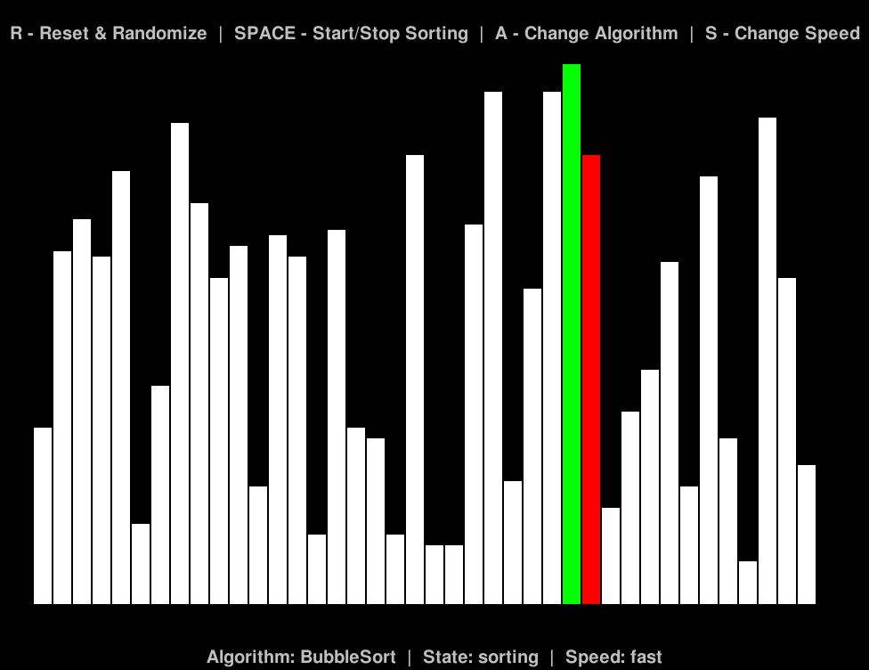

# Sorting Visualizer

A simple sorting visualizer implemented in Python using Pygame.

## Description

This program visualizes various sorting algorithms in real-time, allowing users to observe how different algorithms perform on a randomly generated list.

## Features

- Visualization of Bubble Sort, Insertion Sort, and Selection Sort.
- Randomization and resetting of the input list.
- Start/stop sorting with the SPACE key.
- Change sorting algorithm with the A key.
- Adjust sorting speed with the S key.

## Prerequisites

- Python 3.x
- Pygame library

## Installation

1. Clone the repository:

   ```bash
   git clone https://github.com/your-username/sorting-visualizer.git

2. Navigate to the project directory:

    ```bash
    cd sorting-visualizer

## Usage

Run the main script:

```bash
python main.py
```

- Press `A` to change the sorting algorithm.
- Press `SPACE` to start/stop sorting.
- Press `S` to change the sorting speed.
- Press `R` to reset and randomize the input list.

## Screenshots

